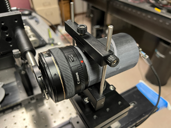
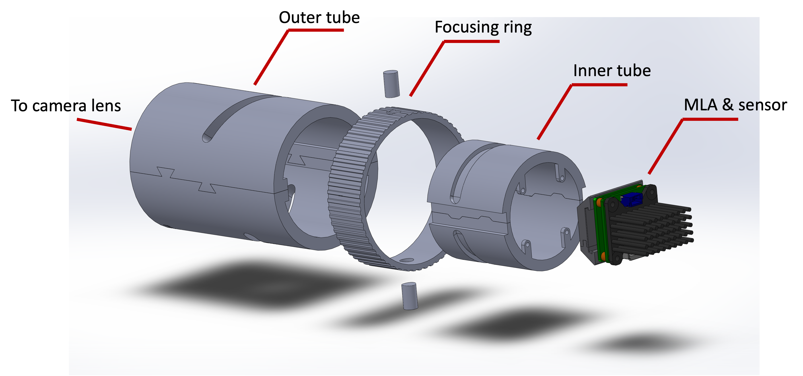
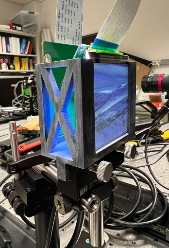
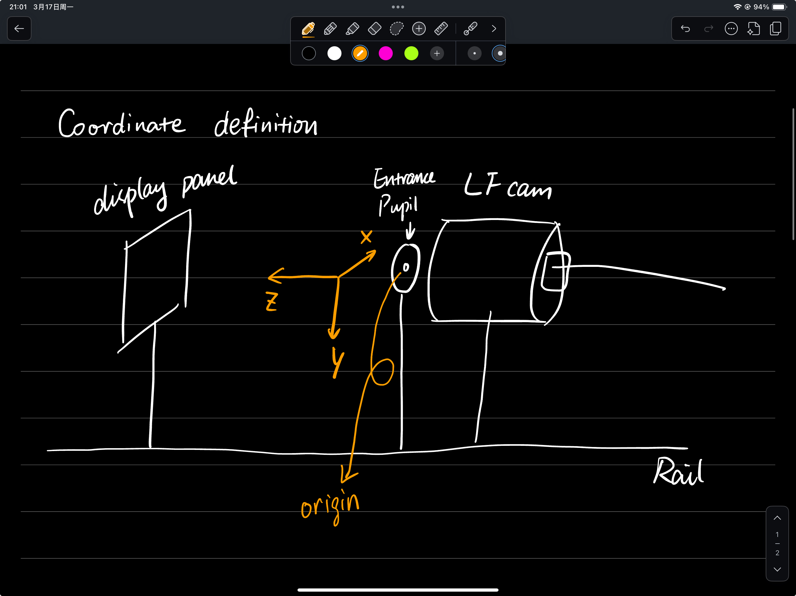

# Light Field Calibration Toolbox -- version 3.7.0

**Feiyi Shen** 

[toc]

- [0. Introduction](#0-introduction)
- [1. Environment](#1-Environment)
- [2. Definitions](#2-Definitions)
- [3. Method](#3-Method)
- [4. Result](#4-Result)
- [5. Code](#5-Code)
- [6. Log](#6-Log)

------

## 0. Introduction

A [light field camera](https://en.wikipedia.org/wiki/Light_field_camera) calibration toolbox for light field 2.0, also known as resolution priority type light field, or focused light field, focused plenoptic camera. Typically, a light field camera consists of an aperture, a camera lens, a micro-lens array (MLA) and a digital image sensor. 

Fig. 1. Current Light Field Camera System Setup

The goal of this project is to calibrate the light field camera and accurately estimate the depth of a 3D scene. 

## 1. Environment

- `Python 3.12.6` 

## 2. Definitions

A display panel is used to help with the calibration process. The optical axis is defined by a pinhole on the rail. The origin of the display is the intersection point of the optical axis and the display. Facing the display, the horizontal line from left to right through the display origin is the *x axis*; the vertical line from top to bottom through the display origin is the *y axis*. The optical axis is the *z axis*, and its positive direction is the direction where the camera is facing. The intersection point of optical axis and entrance pupil plane is the origin of the depth. In other words, the entrance pupil is at depth equal to $0mm$. 

Fig. 2. Display Panel & Coordinate definition

Elemental image (EI) is defined as the small image behind each micro lenslet. It is also named as subimage. 

In this setup, the aperture does not need to be optically conjugate to the lenslets. It functions as a vignetting aperture to control the amount of overlapping among EIs. The real stop for each sub-system is on each micro lenslet. An aperture array is printed out with transparent film and inseted in front of the MLA. 

## 3. Method

0. Alignment 
    1. Align an **aperture** with the rail using a laser beam. 
    2. Assemble the **light field camera** (LFCam) and align it on the rail. 
    3. Set up the **display** and align it perpendicular to the rail. 
    4. Align another (conventional) **camera** with the aperture, use this camera to locate the center pixel of the display. 
1. Before Calibration 
    1. Put the aperture in front of the LFCam. Adjust the aperture size until each elemental image is not overlapping (or even smaller). Put a white light source in front of the aperture and capture the image. The image doesn't need to be sharp (in focus), but the shape of the aperture should be seen. The purpose is to locate the center position of each elemental image. 
    2. Open up the aperture and let EIs have slight overlap. Because the MLA is rectangularly arranged while the aperture shape is circular, this helps maximize the effective imaging area on the sensor. For the overlapping images, we can crop it out before further processing. 
    3. (Optional) Put the white light source in front and capture another image as flat image to help remove vignetting. This would be helpful if the system has strong vignetting. 
2. ST Calibration
    1. Remember the position of the aperture, remove it and put the display at the exact position. 
    2. Sample the ST plane with dots evenly spaced on the display. Record the position of each dot and capture corresponding images. (for both training dataset and validation dataset)
    3. Detect the blurred dot in each elemental image. The center of the blurred dot is considered as the chief ray position. 
    4. Map each elemental image to ST plane. (using distortion model) 
    5. Validate mapping quality using validation dataset. 
3. UV Calibration 
    1. Put the aperture back and move the display to some depth away from the LFCam. (one or more depth planes) 
    2. Sample the depth plane with dots shown on the display. Record. 
    3. Detect the center of the dot image and convert the coordinates to ST plane. 
    4. Line up multiple dots-images, the waist of the ray bundle is considered as the UV position for one sub-system (optical conjuagte to one lenslet). Also known as virtual camera. 
    5. Fit the array of virtual camera into distortion model and sphere model (for field curvature compensation) 
4. Validate the overall calibration result with a tilted checkerboard pattern. 

## 4. Result

## 5. Code

## 6. Log

**Version 3.7.0.1** 

**2025/04/02** Update and validate previouly finished functions and methods. Finish `_convert_ApCenters_to_corners`. To do elemental image segmentation. 

**2025/04/01** Clear code structures in two mind map files. Next step: elemental image segmentation. 

**2025/03/31** Finish feature point detection in LFImage class. To do: elemental image segmentation. 

**2025/03/18** Update calibration method. Update Python code structure. 

**Version 3.7.0.0** 

**2025/03/17** Upload `README.md`. Currently cleaning up the code and redoing the calibration. The reason is that a new project came (good excuse) and I have to postpone this project. Now I'm trying to (have to) finish this project as soon as possible. 
