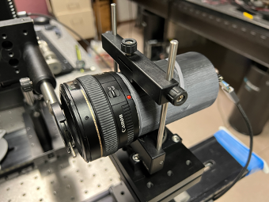
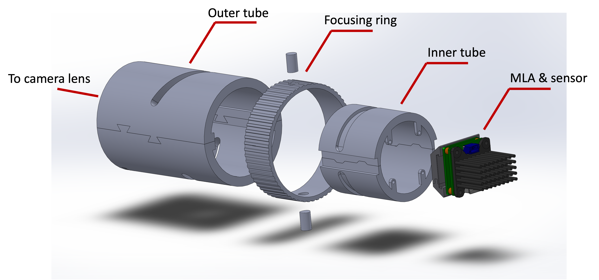
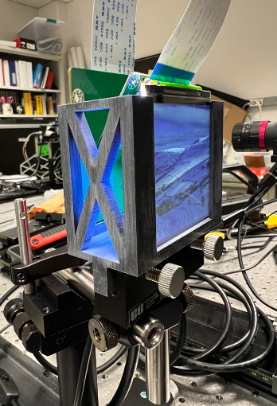

# LFToolbox -- version 3.3

[toc]

------

## 0. Introduction 

A [light field camera](https://en.wikipedia.org/wiki/Light_field_camera) calibration toolbox, for light field 2.0, also known as resolution priority type light field, or focused light field, focused plenoptic camera. Typically, a light field camera consists of an aperture, a camera lens, a micro-lens array (MLA) and a digital image sensor. 

Fig. 1. Current Light Field Camera System Setup

The goal of this project is to calibrate the light field camera and accurately estimate the depth of a 3D scene. 

## 1. Code Environment 

-   Python 3.12.2
-   colour-science 0.4.4
-   matplotlib 3.8.2
-   numpy 1.26.4
-   opencv-contrib-python 4.9.0.80
-   openpyxl 3.1.2
-   pillow 10.2.0
-   scipy 1.12.0

*Note: This project is not sensitive to different versions of packages.*

## 2. Definitions 

A display panel is used to help with the calibration process. The optical axis is defined by a pinhole on the rail. The origin of the display is the intersection point of the optical axis and the display. Facing the display, the horizontal line from left to right through the display origin is the *x axis*; the vertical line from top to bottom through the display origin is the *y axis*. The optical axis is the *z axis*, and its positive direction is the direction where the camera is facing. The intersection point of optical axis and entrance pupil plane is the origin of the depth. In other words, the entrance pupil is at depth equal to $0mm$. 

Fig. 2. Display Panel

## 3. Method 

*To be written* 

## 4. Code 

## 5. Log 

**Version 3.3.0.0** 

**2024/03/21** Upload `README.md`, prepare to upload other files after paper published (haven't started writing yet) 